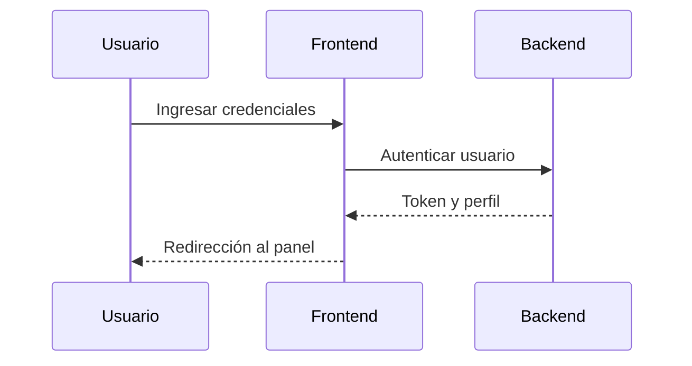

 

# Objetivo

- Guiar a los usuarios finales en el uso correcto y seguro del software, cubriendo las funcionalidades principales y avanzadas.

# Público objetivo

- Usuarios finales, jefe de operaciones, jefe de mantenimiento y tecnicos. Nivel técnico: básico–medio.

# Requisitos previos

- Acceso al sistema, credenciales válidas y permisos asignados.
    - Acceso al sistema
      - Credenciales válidas: Cada usuario debe de contar con un usuario y contraseña para hacer uso del aplicativo
    - Permisos asignados
      - Aministrador:Acceso completo al sistema, Gestionar usuarios y cargos, Configuración del sistema, Todas las funcionalidades disponibles y Eliminar registros del sistema
      - Jefe de mantenimiento: Supervisión general de la flota, Acceso a reportes y estadísticas, Gestión de vehículos Control de notificaciones
      - Jefe de operaciones: Ver notificaciones asignadas, Consultar información de vehículos y Acceso limitado al sistema
      - Técnico: Supervisión general de la flota, Acceso a reportes y estadísticas, y Gestión de vehículos Control de notificaciones
- Navegador recomendado / versión del cliente / requisitos de red.
  - Google Cromeversión 115 o superior
  - requisitos de red: conexión estable de al menos 50 Mbps; acceso al aplicativo MantenimientoExprés
- Conocimiento básico del dominio del negocio: el usuario debe conocer
  - Tipo de vehiculos gestionados (buses, vans, rutas, vehiculos)
  - Fechas clave: vencimiento de SOAT, RTM (Revisión Técnico-Mécanica) y Revisión preventiva
  - Ingreso para de revisiones preoperacionales para reportar y actualizar la flota vehicular de la empresa 

# Acceso y autenticación

1. Navega a la URL de inicio de sesión: `<http://localhost:3000/login>`.
2. Introduce correo institucional y contraseña.
    - Correo institucional: ejemplo@Bolivariano.com
    - Contraseña: es la asignada por el usuario

# Navegación general

- Barra superior: inicico, inspecciones, busqueda, fechas de vencimiento, notificaciones, usuario, cargo y cerrar sesión.
- Área de trabajo: inspecciones recientes, proximos vencimientos.
- Accesos rápidos: nueva inspección, buscar información, gestionar fechas, ver notificaciónes.

# Funcionalidades del software

> Sustituye los ejemplos por tus funcionalidades reales. Mantén la estructura por módulo.

## Módulo A — Operación

- Descripción: `<Registro de las reviciones preoperacionales de la flota vehicular de la empresa>`
- Prerrequisitos: `<jefe de taller y tecnico, número interno, placa, marca, tipo modelo, kilometraje>`
- Pasos básicos:
  1. `<Ir a inspecciones>`
  2. `<Darle en Nueva inspecció>`
  3. `<Completar el formulario con los datos obligatorios>`
  4. `<Darle en el botor "crear inspección">`
- Validaciones y mensajes: `<placa duplicada, ya existe un vehiculo con esa placa>`
- Exportación y reportes: `<inspección preoperacional, agregada exitosamente>`

## Módulo B — Gestión

- Descripción: `<Actualización de información y fechas de vencimiento, editar o eliminar registros de inspecciones preoperacionales>`
- Prerrequisitos: `<Jefe de taller>`
- Flujo:
  1. Crear nuevos registros de inspecciones y fechas de vencimiento
  2. Editar información existente
  3. Eliminar registros que sean necesarios
  4. Auditar cambios realizados

## Módulo C — Reportes

- Fuentes de datos: `<tablas vehiculos, APIs vencimientos>`
- Filtros y segmentos: `<fecha de vencimiento, número interno, placa, documento proximo a vencer>`.

# Ejemplos de uso

## Básico

- Consultar estado del sistema: panel de inicio con resumende inspecciones y vencimientos.
- Buscar registros: barra de búsqueda global.

## Avanzado

- Configurar automatizaciones: configurar notificaciones por correo 7 dias antes del vencimiento.

# Accesibilidad y atajos

- Navegación por teclado: `Tab`, `Shift+Tab`, atajos configurables.
- Contraste ajustables y fuente ampliada para usuarios con baja visión.
- Texto alternativo en iconos y botones

# Seguridad y privacidad

- No compartas credenciales como lo es tu correo institucional y contraseña.
- Exportar datos solo desde entornos autorizados.

# Solución de problemas

- No puedo iniciar sesión: verifica credenciales de correo y contraseña si son correctos
- Operación rechazada: comprueba permisos y datos obligatorios.
- Vista vacía: revisa filtros activos y fecha.

# Preguntas frecuentes (FAQ)

- ¿Cómo recupero mi contraseña? `<Comunicarse con los administradores para recuperar ingreso al aplicativo>`
- ¿Cómo exporto un reporte? `<Desde el apartado de fechas de vencimiento, haz click en "exportar" y elegir el formato (CSV, XLSX, PDF)>`
- ¿Cómo solicito un nuevo permiso? `<Enviar solicitud al administrador por medio correo electronico y esperar confirmación>`

# Soporte

- Horario de atención: `<Lunes a viernes, 8:00 a.m. - 5:00 p.m.>`
- SLA: respuestas maximo en 24 horas hábiles